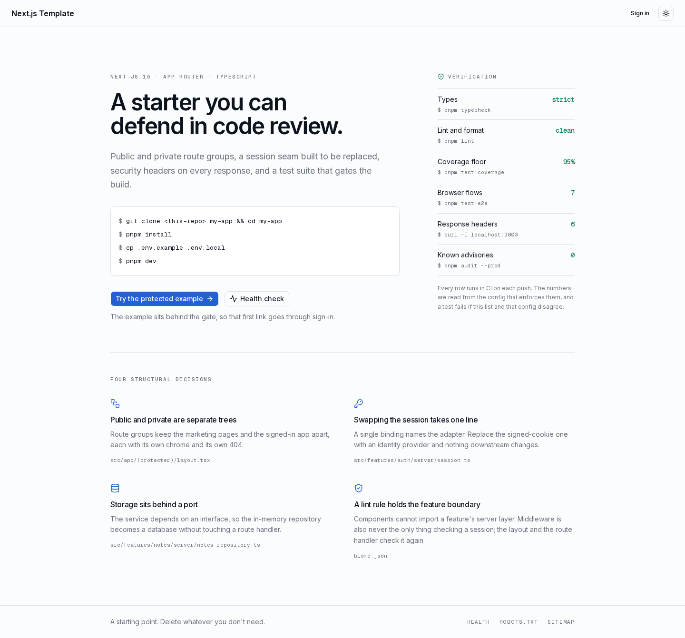
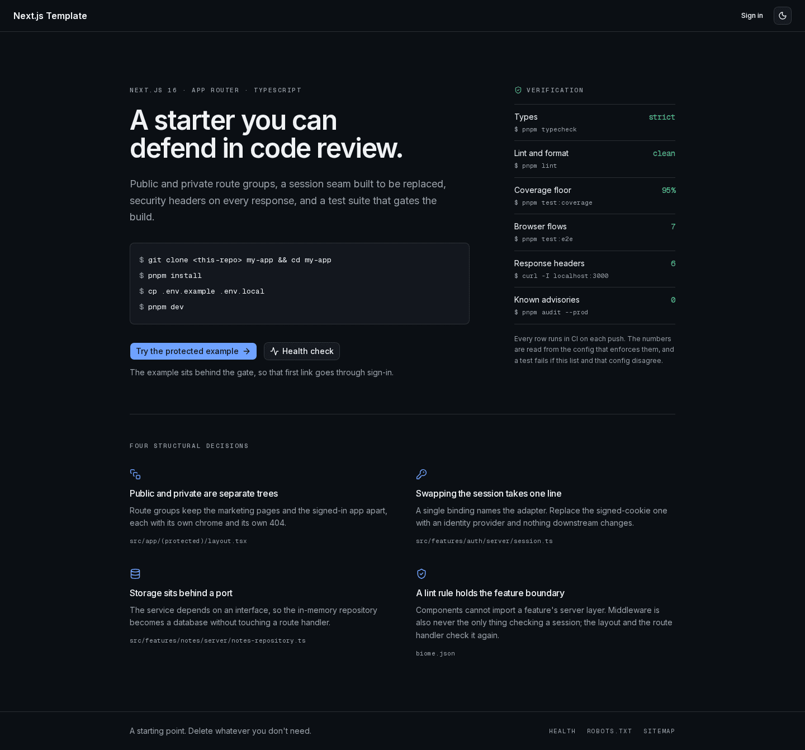
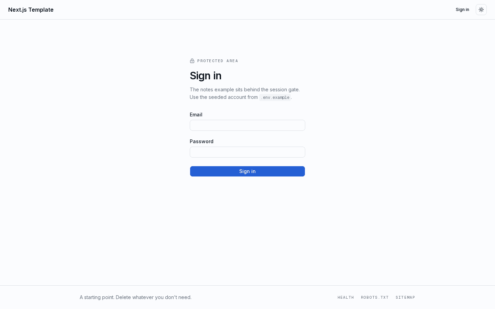
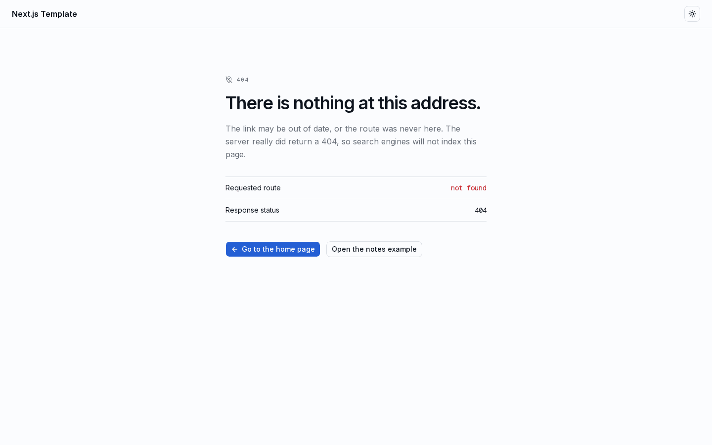

# Next.js Template

[](LICENSE)

A clone-and-launch starter for scalable Next.js apps: App Router + TypeScript, Tailwind CSS v4 + shadcn/ui, Biome, Vitest, type-safe env, dark mode, and two languages — with a feature-based architecture, a session backed by a real API, and a test-first workflow.

Everything the landing page claims about this repo is checked by a command you can run yourself, and it lists them.



<details>
<summary>More screenshots</summary>

The same page in dark mode. Both themes come from one token block in `src/app/globals.css`.



The notes example, behind the session gate. Covers are served through `next/image` from the one remote host the CSP allows.


Sign-in, and the 404 that any unmatched URL returns with a real 404 status.





</details>

## Stack

- [Next.js](https://nextjs.org) (App Router) + React 19 + TypeScript
- [pnpm](https://pnpm.io)
- Tailwind CSS v4 + [shadcn/ui](https://ui.shadcn.com)
- [Biome](https://biomejs.dev) — lint + format (no ESLint/Prettier)
- [Vitest](https://vitest.dev) + Testing Library + jsdom
- [Playwright](https://playwright.dev) — end-to-end, against the production build
- [jest-axe](https://github.com/nickcolley/jest-axe) — accessibility assertions
- [next-themes](https://github.com/pacocoursey/next-themes) — dark mode
- [`@t3-oss/env-nextjs`](https://env.t3.gg) + [zod](https://zod.dev) — type-safe env
- [Husky](https://typicode.github.io/husky) + lint-staged + commitlint — hooks

## Architecture

Feature-based: each feature colocates its own components, server code, and tests. Shared building blocks live in top-level folders.

```
instrumentation.ts             # server-boot hook: logger and metrics
src/
  proxy.ts                     # correlation id, session gate, token refresh, rate limit
  app/
    (public)/                  # marketing chrome
      page.tsx                 # /
      login/page.tsx           # /login
    (protected)/               # session required
      layout.tsx               # re-checks the session, then renders the chrome
      notes/page.tsx           # /notes
      settings/page.tsx        # /settings
      requests/page.tsx       # /requests
      not-found.tsx            # 404 inside the app shell
    api/health/route.ts        # GET /api/health
    api/metrics/route.ts       # GET /api/metrics, for Prometheus
    api/notes/route.ts         # GET/POST /api/notes
    api/account/route.ts       # PATCH the signed-in profile
    api/account/password/route.ts
    not-found.tsx              # 404 for any unmatched URL
    error.tsx, global-error.tsx, loading.tsx
    robots.ts, sitemap.ts
  features/
    auth/
      server/
        session-provider.ts    # the port
        api-session.ts         # the adapter — replace this one
        session.ts             # the composition point
        token-exchange.ts      # login and refresh against the API, edge safe
        tokens.ts              # the two httpOnly cookies
        jwt-claims.ts          # reads exp; never verifies
        auth-actions.ts        # sign in / sign out (Server Actions)
        safe-redirect.ts       # open-redirect guard
      components/login-form.tsx
    preferences/               # locale, theme and the toast reference, per account
    settings/                  # the settings screen and its writes
    requests/                  # the request log screen
    notes/
      server/
        notes-repository.ts    # the port
        in-memory-notes-repository.ts
        notes-service.ts       # use cases, scoped to the session owner
      components/notes-widget.tsx
    verification/              # the ledger shown on the landing page
  components/
    account-menu.tsx           # language, theme and sign out
    toaster.tsx, problem-toast.tsx, copy-button.tsx
    ui/                        # shadcn primitives (generated; excluded from lint)
  i18n/                        # dictionaries, negotiation, provider
  hooks/use-copy.ts
  lib/
    api-client.ts              # the only thing that talks to the API
    request.ts                 # the browser's fetch wrapper
    security-headers.ts, http.ts, rate-limit.ts, utils.ts, flags.ts, outcome.ts
    logger.ts, metrics.ts, with-route-logging.ts
    request-id.ts, request-context.ts, request-id-client.ts, request-id-server.ts
  env.ts                       # validated, typed environment variables
```

The `notes` feature is the reference vertical slice: a `NotesRepository` port with an in-memory adapter, a service that scopes every read and write to the session owner, a thin Route Handler on top, and a client component that talks to it. Copy it to build new features.

Two boundaries have tooling behind them. Biome's `noRestrictedImports` stops components importing a feature's server layer, and the session is checked three times: `src/proxy.ts` redirects early on cookie presence, the protected layout asks the API who the caller is, and the API checks the token again on every call.

## Requirements

- Node.js 22.13+
- pnpm 9+

## Setup

```bash
pnpm install
cp .env.example .env.local
```

## Develop

```bash
pnpm dev
```

Open http://localhost:3000. The notes example lives at `/notes`, behind the gate. Sign in with an account from the API, which has to be running: `docker compose up -d` in the `fastapi-template` repository.

`pnpm dev:logs` runs the same server and feeds the shared log directory the search stack reads. It forces `LOG_FORMAT=json` and writes only the JSON lines to the file, because Next's own dev output is prose and a log pipeline parses what it is given — the terminal still shows everything. See [Observability](#observability).

## Authentication

Sign-in goes to the sibling `fastapi-template`, which is the only thing that verifies a password. Point `API_URL` at it and seed an account there; there is no demo account in this repository any more.

The browser never sees a token. `POST /auth/login` returns an access and a refresh token, and both are stored as httpOnly cookies on this side (`src/features/auth/server/tokens.ts`), so every call to the API is made by a server component, a Server Action, or a route handler — which is also why the CSP can keep `connect-src 'self'`.

An access token lasts 30 minutes and a refresh token a week, so something has to rotate them. Two places do:

- `src/proxy.ts`, before a render. It is the only layer that can write a cookie *and* rewrite the forwarded `cookie` header, so the navigation that triggered the refresh does not render as signed out.
- `src/lib/api-client.ts`, on a 401. It refreshes once, replays the call, and gives up if the refresh is refused. A cookie write from a render is refused by Next, so that failure is swallowed deliberately and the proxy persists the rotation on the next request.

Signing out retires the token. `destroy()` posts the refresh token to `POST /auth/logout`, which marks its stored row revoked, and then clears the cookies — so a copy of that token taken beforehand is dead too. Changing a password revokes every refresh token the account has.

To use a different identity provider, write an adapter satisfying `SessionProvider` and change one binding in `src/features/auth/server/session.ts`. Nothing outside that file names an implementation.

## Observability

Every request carries a correlation ID, and every log line is one JSON object that includes it. A user who quotes the reference off an error screen has handed you everything you need to find the request.

`src/proxy.ts` mints the ID. A caller that already sent `x-request-id` keeps it, which is how an upstream service or a native client stitches its logs to these; anyone else gets a fresh one. Inbound values are checked against `[A-Za-z0-9_-]{1,64}` and replaced when they fail, because a header is untrusted input and a newline in it would forge log lines.

The ID leaves in four directions: forwarded on the request so renders and route handlers see it, set on the response header so a `fetch` caller can read it, dropped in a readable `x-request-id` cookie so the client error boundary can quote it without a round trip, and sent on to the API as `X-Request-ID`, which is what makes one id line up across both services' logs and the API's request table.

When something fails, the id reaches the reader as a toast: `src/components/problem-toast.tsx` turns a refusal into an amber one and a server error into a red one that stays until it is dismissed, each carrying the id in mono with a copy button. The id is resolved from the response header, then the body's `request_id`, then the page's own cookie — and when even that is missing, the toast says so instead of showing an empty box.

Two loggers write, because the edge runtime cannot run pino:

- `src/proxy.ts` writes one `request.received` line per request with a hand-built `console.log(JSON.stringify(...))`. This is the only record of a page load.
- `src/lib/logger.ts` is pino, for everything in the Node runtime. `withRouteLogging` wraps a route handler and writes one `request` line with the status and duration. `AsyncLocalStorage` carries the ID, so no call site has to pass it.

```json
{"level":"info","timestamp":"2026-08-20T20:29:45.997Z","service":"nextjs-template","request_id":"single-sink-002","method":"GET","path":"/api/health","status_code":200,"duration_ms":0.304,"event":"request"}
```

Lines record method, path, status, duration, client IP and the correlation ID. Bodies, query values and headers stay out, so there is no redaction list to keep current.

`LOG_FORMAT=console` swaps the JSON for a readable stream while you work. `LOG_FILE` adds a file sink on top of stdout, for a platform that wants one.

Prometheus metrics are served at `/api/metrics`, from `prom-client`. Set `METRICS_ENABLED=false` to withdraw the route. The counters live in the process, so behind more than one Node worker each reports only its own share.

### Searching the logs

This template writes the logs and serves the metrics; something else has to store and search them. One Loki per project also means one Grafana per project, and two queries every time an ID crosses a service boundary.

The companion `devstack` repository runs Loki, Grafana, Alloy and Prometheus once for every project on the machine. Run the app with `pnpm dev:logs` and its output lands in `~/.local/state/devlogs/`, which is where that stack looks:

```bash
pnpm dev:logs        # writes ~/.local/state/devlogs/<package name>.jsonl
```

Only lines that start with `{` reach that file. `LOG_FORMAT=console` is for reading in a terminal, and a mixed file is worse than either: Loki's `| json` fails on the prose, and the failed lines sit in Grafana next to the real ones as parse errors.

Set `DEV_LOG_DIR` to write somewhere else. Then register `/api/metrics` by dropping one file into that repository's `prometheus/targets/`; its README has the details.

Set `SERVICE_NAME` in `.env.local` when you derive a project from this template. It becomes the `service` label in Loki and the filter in every query, so `jobtrail-web` and `loreweave-web` left on the default name would collapse into one stream.

Without `devstack` everything still works: `pnpm dev` prints the same JSON, and `jq` reads it.

## Internationalisation

Two languages, `en-US` and `pt-BR`, negotiated per request: the `locale` cookie wins, then `accept-language`, then the default. There is no `[locale]` segment, so no URL changes and no route duplication.

Dictionaries are plain nested objects under `src/i18n/dictionaries/`. `en-US.ts` declares `Dictionary = typeof enUS` and `pt-BR.ts` is annotated with it, so a missing key is a type error. Three tests hold what the type cannot: the two files must have the same key paths and leaf types, neither may contain a function (the object crosses the RSC boundary, and React cannot serialise one), and both must ask for the same `{slot}` names. Interpolation is `fill(template, values)`.

A server component reads `await getDictionary()`; a client component reads `useDictionary()` from the provider mounted in the root layout. The trade is that both dictionaries' worth of strings for the chosen language crosses to the client on every page — a few KB today. If it grows, hand each client component the namespace it needs.

Choosing a language writes the cookie, mirrors it into `localStorage`, and saves it on the account when there is one, so it follows the reader to another device. The theme works the same way through `next-themes`.

## Feature flags

`FEATURE_FLAGS` names the **optional** features this environment serves. Settings and the request log are not in that list: they are part of the app, and a flag over them would only be a way to break it. The example slice, `notes`, is what a flag is for — a feature that can ship dark, disappear from the header, and answer 404 until it is ready.

Flags resolve in two steps. The environment sets the default, which is a deploy-time decision; an account that has named its own list in the settings screen overrides it, which is how someone previews a feature without a redeploy. `resolveFlags` in `src/lib/flags.ts` is that whole rule: the account's list if it has one, the environment's otherwise. `null` in the account's column means "follow the environment", and an empty string is a real answer — this account wants none of them.

The variable is server-only on purpose. Every screen that reads a flag is rendered on the server, and a flag name can describe work nobody has announced, so there is no reason for the list to reach the browser.

The API keeps its own `FEATURE_FLAGS` for endpoints, and that is deliberately a separate decision: a screen can be hidden while its endpoint stays available to another client, and an endpoint can be withdrawn without redeploying the frontend. The settings screen reads `GET /api/v1/features` and only offers the request log when the API is actually storing one.

The request log itself is reached from the settings screen rather than the header, which stays about the app instead of its instrumentation. It pages by cursor: the API hands back a `next_cursor` instead of a total, because counting a table that grows by one row per request is the expensive part of reading it, so the pager offers **Older** and a way back to the newest rather than page numbers.

## Test-driven development

Vitest + Testing Library. Tests are colocated as siblings, and the extension picks the environment: `*.test.ts` runs in node for server code, `*.test.tsx` runs in jsdom for components.

Red → green → refactor:

1. Write a failing test next to the code.
2. Run it and watch it fail.
3. Write the minimal code to pass.
4. Refactor with the test as a safety net.

```bash
pnpm test           # run once
pnpm test:watch     # watch mode
pnpm test:coverage  # with enforced thresholds
pnpm test:e2e       # Playwright, against a production build
```

## Adding a feature

Copy the `notes` slice and rename:

1. `src/features/<name>/types.ts` — zod schema + types.
2. `src/features/<name>/server/<name>-repository.ts` — the port.
3. `src/features/<name>/server/<name>-service.ts` — use cases, taking the port.
4. `src/features/<name>/server/index.ts` — bind the adapter.
5. `src/app/api/<name>/route.ts` — a thin HTTP adapter, or a Server Action.
6. `src/features/<name>/components/` — client components.
7. Colocate tests as siblings of the files they cover.

### Which one a write should be

A Server Action when the reply is the point: the answer is a navigation, a
redirect, or fresh data the current route has to show. Signing in, signing out,
deactivating an account and every preference are actions for that reason.

A route handler when the form only needs to know whether the write worked.
Every Server Action reply re-renders the route it was called from, and a route
that reads the API three times to render makes the form's pending state outlive
the answer — which is what the profile and password forms in `/settings` ran
into. They post to `src/app/api/account/**` and read a small JSON answer, so the
button leaves "Saving…" the moment the API replies. `src/lib/request.ts` turns a
refusal into the same `Problem` the toast already knows how to show, so the
correlation id survives the trip.

The cost of that choice is that such a form needs JavaScript, so both of them
keep their submit button disabled until `useHydrated` says the island is
interactive. A Server Action form does not need this: it posts and works before
any of its JavaScript arrives.

## Environment variables

Defined and validated in `src/env.ts`, which `next.config.ts` imports so an invalid environment fails the build rather than production. Add new variables there and import from `@/env` for typed access. Set `SKIP_ENV_VALIDATION=1` to bypass validation.

Everything that needs to know the origin reads `NEXT_PUBLIC_APP_URL`: `metadataBase`, `robots.txt`, the sitemap, whether the token cookies are `Secure` and `__Host-` prefixed, and whether the CSP sends `upgrade-insecure-requests`. Set it to your real https origin in production.

`API_URL` points at the backend, including its version prefix. It is server-only on purpose: the browser has no business knowing where the API lives.

## Security

Security headers are defined in `src/lib/security-headers.ts` and applied to every response. `POST /api/notes` returns 401 without a session, 415 for a non-JSON content type, 400 for a malformed body, 413 for an oversized one, and 409 at the per-owner limit. The `?next=` parameter is filtered against open-redirect payloads, and an inbound `x-request-id` is filtered before it reaches a log line.

The gate in `src/proxy.ts` denies by default: everything that is not named in `PUBLIC_PAGES` or `PUBLIC_API` needs a session, so a screen added next month is protected by forgetting rather than by remembering. It rate-limits gated API paths and the sign-in POST, and deliberately leaves Server Actions alone: a 429 is not an answer a Server Action can give, so React receives a body it cannot read and the form stays pending forever. The endpoints worth throttling are throttled by the API, which can answer with a message. One consequence worth knowing: a signed-out visitor who types an unknown URL is bounced to sign-in rather than shown the 404.

See [SECURITY.md](SECURITY.md) for what to change before deploying.

## Quality tooling

```bash
pnpm lint        # biome check (lint + format + import order)
pnpm format      # biome check --write (apply fixes)
pnpm typecheck   # tsc --noEmit
pnpm build       # production build
pnpm verify      # typecheck + lint + coverage + build
```

Hooks are the gate, because there is no CI workflow: `lint-staged` on commit, `commitlint` on the message, and on push typecheck, the unit suite, and the browser suite whenever the sibling API is answering — it says so and skips when it is not. `pnpm audit --prod --audit-level moderate` stays yours to run.

Pushing the browser suite into the hook is deliberate. Every defect this template shipped and then fixed in its first days — a select that rendered but did nothing readable in the dark, a control that changed state and saved nothing, a rate limit that left a form pending forever — was invisible to the unit suite and obvious to the browser one.

`pnpm test:e2e` drives a production build against a live API, so it needs `fastapi-template` up. It registers an account of its own for each run, because the signed-in specs change a name and a password and should not be doing that to an account you use, and deactivates it again on the way out; set `E2E_EMAIL` and `E2E_PASSWORD` to point at an existing one instead, and the suite leaves it alone.

The toast is covered there rather than only in unit tests: a spec intercepts `POST /api/notes`, forces a 500 and a 409, and asserts the error and warning treatments, the correlation id in the body, and that the copy button really puts it on the clipboard.

Two helpers in `e2e/support.ts` exist because React hydrates island by island. `ready` waits for a client effect to have run at all, and `submitUntil` retries an interaction until its outcome appears — a click that lands before a form's island is interactive does nothing, and a suite that pretends otherwise fails one run in three for reasons that have nothing to do with the app. A form that cannot work before hydration should say so instead: the two account forms keep their submit button disabled until `useHydrated` flips, which is a signal the suite can wait on and a person can see. The suite fails in one second with a readable message when the API is not answering.

## Styling

Colors, radii, and fonts are tokens in `src/app/globals.css`. Restyling the template means editing that block, not the components. Tailwind CSS files and the generated `src/components/ui/**` are excluded from Biome.

## Adding shadcn components

```bash
pnpm dlx shadcn@latest add <component>
```

## Contributing

See [CONTRIBUTING.md](CONTRIBUTING.md). Licensed under [MIT](LICENSE).
